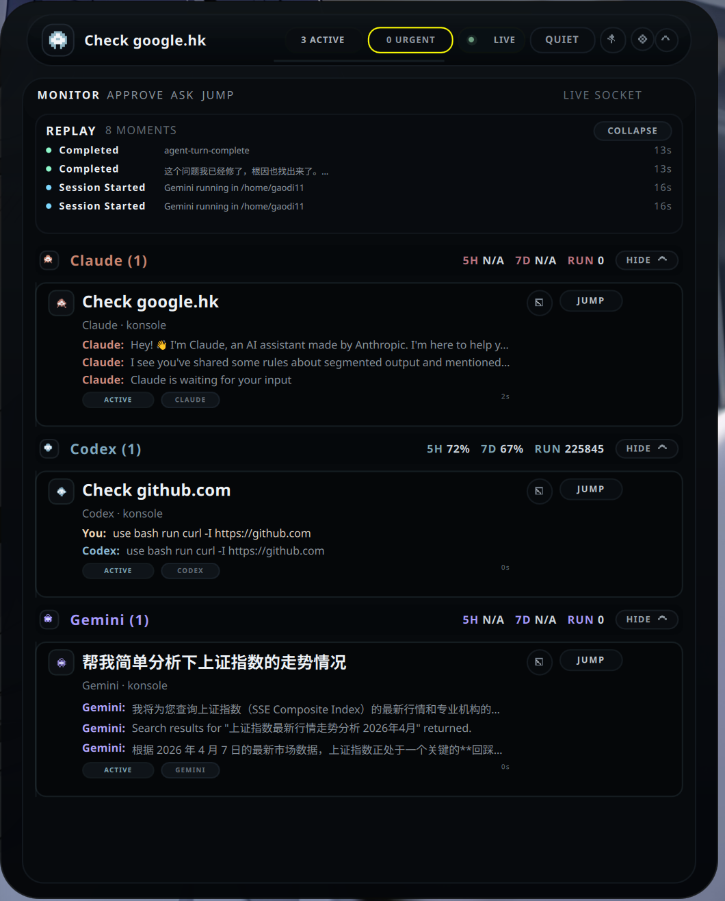
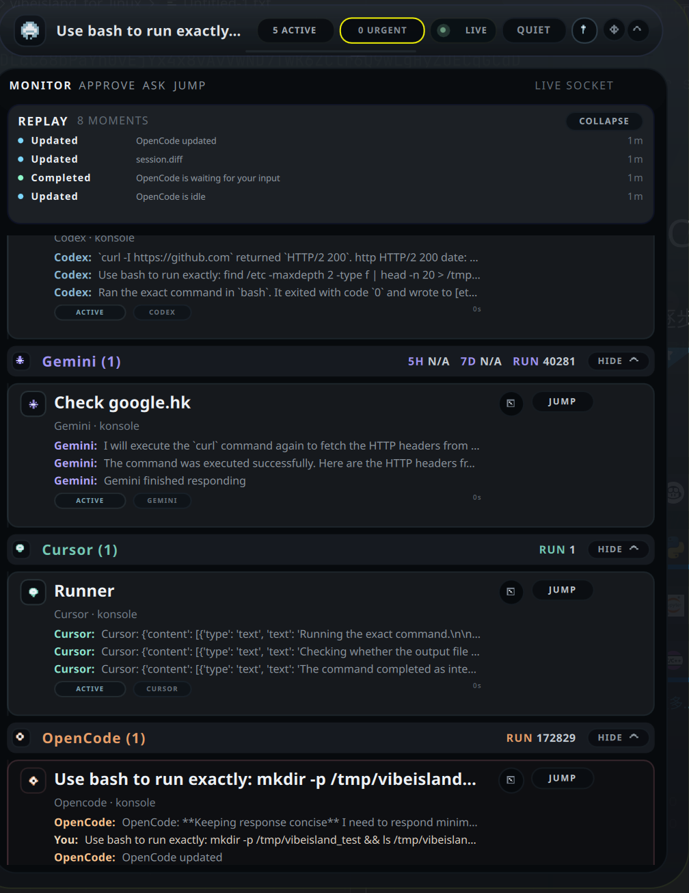

# VibeAgentIsland-archlinux

English version: [`README.md`](./README.md)

`VibeAgentIsland-archlinux` 是当前这条 Arch Linux / KDE Plasma / Wayland / Konsole 公开发布路线使用的仓库名，它承载的是本地优先的 Vibe Island “Agent 灵动岛”桌面壳层。它可以持续观察 Claude Code、Codex、Gemini CLI、Cursor CLI 和 OpenCode 的实时会话状态，在真正需要你介入审批或回答时把注意力拉回来，并且帮你跳回正确的终端。

## 当前发布状态

当前公开首发版本目标：`0.1.0-beta.1`

这次第一次 GitHub 开源发布已经可以承担真实本地工作流，但仍然会对开发和测试时使用的环境有明显优化倾向。

## 截图预览

展开态分组界面：



缩放态 notch 界面：


当前 beta 中新增的 Cursor / OpenCode 支持：



## 本版各 provider 的真实支持状态

- `Claude Code`：在一等支持环境下已经可以日常使用
- `Codex CLI`：在一等支持环境下已经可以日常使用
- `Gemini CLI`：当前是“最小可用”支持，已经覆盖 live 会话、分组卡片、jump、peek、岛内审批与 Telegram 审批
- `OpenCode`：在一等支持环境下已经实测过 live 状态、分组卡片、jump、peek、Telegram 提示与岛内审批交互
- `Cursor CLI`：目前已经接入 live 状态、分组卡片、jump、peek 与状态采集；审批交互链路虽然已接线，但这一版仍按“尚未完全实测确认”来说明

## 它是干什么的

- 在一个浮动壳层里同时监控多个 Claude Code / Codex / Gemini CLI / Cursor CLI / OpenCode 会话
- 展开态默认按 provider 分组，让 Claude、Codex、Gemini、Cursor、OpenCode 五类工作更直观地分开
- 对于本地可读配额窗口的 provider，`5H / 7D / RUN` 会直接显示在对应分组标题后面；Cursor 与 OpenCode 当前只显示 `RUN`
- 遇到真正的审批和提问时自动展开
- 支持岛内审批、回复、mini terminal peek 和 jump 回原终端
- 提供 usage HUD、replay 时间线、idle/sleep 折叠态，以及可选的 Telegram 远程审批
- 提供可选的 `Aero Glass` 外观模式，并支持保存透明度滑条设置
- 当新的审批/提问出现时，不仅可以把岛前置展开，还会自动滚到对应的那张对话卡，方便第一时间按按钮处理
- 整体采用本地架构：Rust daemon、Unix socket、SQLite、PyQt6/QML shell
- 展开态默认按 Claude / Codex / Gemini / Cursor / OpenCode 分组显示，而不是混成一整面长列表
- 对话卡会优先显示最近三行真实对话，并明确区分 `You` 和对应 Agent，而不是只塞一条通用摘要

## 当前一等支持环境

当前的一等支持环境是：

- Arch Linux / EndeavourOS
- KDE Plasma 6
- Wayland
- Konsole

其他 Linux 桌面和终端目前仍然按 best-effort 处理。

## 运行要求

- Python 3.12 或更高版本
- 带 `cargo` 的 Rust 工具链
- Python 环境中可用的 PyQt6
- 本地已安装 Claude Code、Codex CLI、Gemini CLI、Cursor CLI 和 / 或 OpenCode
- 如果你想获得当前最稳的体验，建议环境为 Arch Linux / KDE Plasma / Wayland / Konsole

## 快速开始

1. 先安装 Claude Code / Codex / Gemini / Cursor / OpenCode 的桥接集成：

```bash
cd /path/to/VibeAgentIsland-archlinux
python tools/vibeisland.py install all
```

2. 用一条命令启动灵动岛：

```bash
cd /path/to/VibeAgentIsland-archlinux
python tools/vibeisland.py launch
```

3. 可选：安装桌面启动入口：

```bash
cd /path/to/VibeAgentIsland-archlinux
python tools/vibeisland.py install-desktop
```

之后你可以直接使用：

```bash
vibeisland
vibeisland status
vibeisland stop
```

## 详细安装步骤：Arch Linux + KDE Plasma + Konsole

如果你的环境和本项目的一等测试环境接近，推荐直接按下面这套流程安装：

1. 安装基础运行依赖：

```bash
sudo pacman -S --needed git python python-pip rustup base-devel qt6-base qt6-declarative qt6-multimedia
rustup default stable
python -m pip install --user PyQt6
```

2. 克隆仓库并进入目录：

```bash
git clone <你的仓库地址> VibeAgentIsland-archlinux
cd VibeAgentIsland-archlinux
```

3. 先分别登录你要使用的 provider：

- `claude` 用于 Claude Code
- `codex` 用于 Codex CLI
- `gemini` 用于 Gemini CLI
- `cursor-agent` 用于 Cursor CLI
- `opencode` 用于 OpenCode

4. 如果你不想自己从零写配置文件，可以先看：

- [`settings_exp/README.md`](./settings_exp/README.md)
- [`settings_exp/README.zh-CN.md`](./settings_exp/README.zh-CN.md)

5. 把灵动岛所需的 hooks 安装到本机 provider 配置里：

```bash
python tools/vibeisland.py install all
```

6. 把已经开着的 provider CLI 全部关掉再重开。尤其是 Gemini 和 Claude，如果不重开，旧进程会继续沿用旧 hooks。

7. 启动灵动岛：

```bash
python tools/vibeisland.py launch
```

8. 可选：安装桌面入口，让 KDE 菜单和 `vibeisland` 命令都能直接使用：

```bash
python tools/vibeisland.py install-desktop
```

之后日常使用的命令就是：

```bash
vibeisland
vibeisland status
vibeisland stop
```

## beta1 已包含的重点能力

- 一条命令同时拉起 daemon 和 shell
- 通过 `install-desktop` 安装桌面入口
- Claude Code + Codex + Gemini + Cursor + OpenCode bridge
- 展开态按 Claude / Codex / Gemini / Cursor / OpenCode 分组展示
- 核心审批与回复可在岛内完成
- Jump 回原终端和 mini terminal peek
- Telegram 远程审批桥接
- provider usage HUD、replay 时间线和 idle/sleep 呈现
- 可选的 `Aero Glass` 外观模式与透明度保存
- 审批自动前置时会直接定位到触发交互的那张卡片

## 配置注意点

- Claude Code 配置文件：`~/.claude/settings.json`
- Codex 配置文件：`~/.codex/config.toml` 与 `~/.codex/hooks.json`
- Gemini 配置文件：`~/.gemini/settings.json`
- Cursor 配置文件：`~/.cursor/cli-config.json` 与 `~/.cursor/hooks.json`
- OpenCode 配置文件：`~/.config/opencode/opencode.json`
- 仓库根目录的 [`settings_exp/`](./settings_exp/) 已经放好了可直接照着改的示例配置
- OpenCode 的详细配置说明和避坑已经单独写在 [`settings_exp/opencode/README.zh-CN.md`](./settings_exp/opencode/README.zh-CN.md)
- Cursor 的详细配置说明和当前审批实测边界已经单独写在 [`settings_exp/cursor/README.zh-CN.md`](./settings_exp/cursor/README.zh-CN.md)
- Claude 在 OAuth 和 API key 模式之间切换时，不能把 `hooks` 和 `statusLine` 删掉
- Codex 需要保留 `approval_policy = "never"`、`notify` 与 `features.codex_hooks = true`
- Gemini 需要保留安装进去的 `hooks` 段
- Gemini 还应该通过 `python tools/vibeisland.py install gemini` 写入的本地 `~/.local/bin/gemini` wrapper 来启动
- 这个 wrapper 会在你没有显式传入审批参数时自动补上 `--approval-mode=yolo`，避免灵动岛已经处理完审批后，Gemini 自己又弹出一层原生审批界面
- 请确保 `PATH` 里 `~/.local/bin` 的优先级高于 NVM 或系统自带的 Gemini 二进制
- Cursor 需要保留 `statusLine` 和 `~/.cursor/hooks.json`，并保持 `approvalMode = "default"`，这样审批检查点才能继续被灵动岛接管显示
- OpenCode 需要保留 `~/.config/opencode/opencode.json` 里的 `node_modules/vibeisland-opencode-plugin` 条目
- Cursor 和 OpenCode 当前没有稳定可信的本地 `5H / 7D` 配额窗口来源，所以界面只显示 `RUN`
- Telegram 是可选功能，绝不能成为灵动岛运行的前提

详细配置说明见：

- [`docs/INTEGRATION_SETUP.md`](./docs/INTEGRATION_SETUP.md)
- [`docs/INTEGRATION_SETUP.zh-CN.md`](./docs/INTEGRATION_SETUP.zh-CN.md)
- [`settings_exp/README.md`](./settings_exp/README.md)
- [`settings_exp/README.zh-CN.md`](./settings_exp/README.zh-CN.md)

## 安装与配置避坑

- 执行 `python tools/vibeisland.py install all` 之后，请把已经开着的 `claude`、`codex`、`gemini`、`cursor-agent`、`opencode` 终端全部彻底关掉再重开。旧进程会继续沿用旧 hooks。
- Gemini 必须命中 `python tools/vibeisland.py install gemini` 写入的 wrapper。如果某个终端表现得还像旧版二进制，请彻底关掉那个终端再重开，或者先执行一次 `hash -r`。
- `PATH` 里 `~/.local/bin` 的优先级必须高于 NVM 或系统自带的 Gemini 路径，不然 Gemini 可能绕开 wrapper，重新弹出它自己的原生审批界面。
- Cursor 的审批链路依赖 `approvalMode = "default"` 和安装好的 `hooks.json`；如果灵动岛里仍然看不到 Cursor 的审批卡，请执行 `python tools/vibeisland.py install cursor` 后重开 CLI。当前 beta 里，Cursor 的审批完成链路仍按“需要继续实测确认”来标注，不把它写成已经完全稳定。
- OpenCode 的审批链路依赖本地 `vibeisland-opencode-plugin`，并且已经在一等支持环境下做过实测；如果 OpenCode 的审批完全不进灵动岛，请执行 `python tools/vibeisland.py install opencode`，确认本地 plugin 仍存在后，再从一个全新终端里重开 `opencode`。
- OpenCode 的配置一定要按 [`settings_exp/opencode/README.zh-CN.md`](./settings_exp/opencode/README.zh-CN.md) 里的步骤走，因为它不只是改 `opencode.json`，还涉及本地生成 plugin 和旧进程缓存问题。
- Claude 在浏览器 OAuth 和 API key 之间切换时，不能把 `~/.claude/settings.json` 里的 `hooks` 和 `statusLine` 删掉。
- Codex 依赖 `approval_policy = "never"`、`notify` 和 `features.codex_hooks = true`。少了其中任何一个，灵动岛审批或状态同步都会出问题。
- Gemini 目前没有稳定可读的本地 `5H / 7D` 配额窗口来源，所以看到 `5H N/A / 7D N/A` 属于预期行为，不是界面 bug。
- Cursor 和 OpenCode 也一样，当前不会显示 `5H / 7D` 配额，这属于预期行为，不是渲染问题。
- 在 KDE Plasma + Wayland 下，`pin` / 始终置顶仍然是 best-effort。真的被其它窗口盖住时，托盘召回是更可靠的兜底方式。
- 当前分组会话列表是“只显示活会话”的表面。如果 provider 进程已经关掉但卡片一时没掉下去，可以直接执行 `vibeisland stop && vibeisland` 重启 shell。
- `settings_exp/` 里的文件只是示例模板，不会替用户自动完成登录。用户仍然需要自己填写鉴权字段，或者先完成 CLI 登录。

## 文档入口

- [`docs/README.md`](./docs/README.md)
- [`docs/README.zh-CN.md`](./docs/README.zh-CN.md)
- [`docs/PRD.zh-CN.md`](./docs/PRD.zh-CN.md)
- [`docs/TECHNICAL_DESIGN.zh-CN.md`](./docs/TECHNICAL_DESIGN.zh-CN.md)
- [`docs/PORTABILITY_ROADMAP.zh-CN.md`](./docs/PORTABILITY_ROADMAP.zh-CN.md)
- [`CHANGELOG.md`](./CHANGELOG.md)
- [`CONTRIBUTING.md`](./CONTRIBUTING.md)
- [`SECURITY.md`](./SECURITY.md)

## 媒体资源

- 截图和演示素材建议统一放在 [`media/`](./media/)

## 公开版边界

这个仓库将整理成公开的 `VibeAgentIsland-archlinux` 项目。

本地的 Claude + Codex 协作运行时会继续作为另一个独立项目存在，不进入灵动岛当前公开版承诺。也就是说，即便没有安装协作运行时，灵动岛本体也必须能独立正常工作。

## 当前 beta 已知限制

- 当前一等体验仍然主要围绕 KDE Plasma + Wayland + Konsole
- `beta1` 里的 Gemini 支持是“最小可用”路线：先覆盖 live 状态、审批/提问、jump、Telegram 与 peek
- Gemini 当前还没有稳定的本地 5h / 7d 配额窗口可读来源，所以岛内会诚实显示 `Unavailable`，而不是伪造百分比
- 分组标题中的配额展示现在按 provider 就地显示，顶部 notch 只保留全局总览
- 分组会话列表现在被当作“只展示活会话”的表面；Claude / Codex / Gemini / Cursor / OpenCode 进程消失后，主卡片应及时退出列表，历史只留在 replay
- Ubuntu 24.04 和 Windows 11 已经进入结构预备范围，但这版仍然只承诺 Linux-first 的可用体验
- OpenCode 在当前一等支持环境下已经实测通过 live、审批/提问、jump、Telegram、peek 和分组 UI
- Cursor 当前已经覆盖 live、分组卡片、jump、peek 和状态采集，但审批交互仍需要后续更多现场实测才能作为“已完全验证”来承诺
- Wayland 下的 pin / always-on-top 仍然是 best-effort
- 测试环境之外的终端 Jump 精准度还在继续提高
- UI 质感已经能满足日常使用，但仍不是最终完成态

## 许可证

MIT，见 [`LICENSE`](./LICENSE)。
